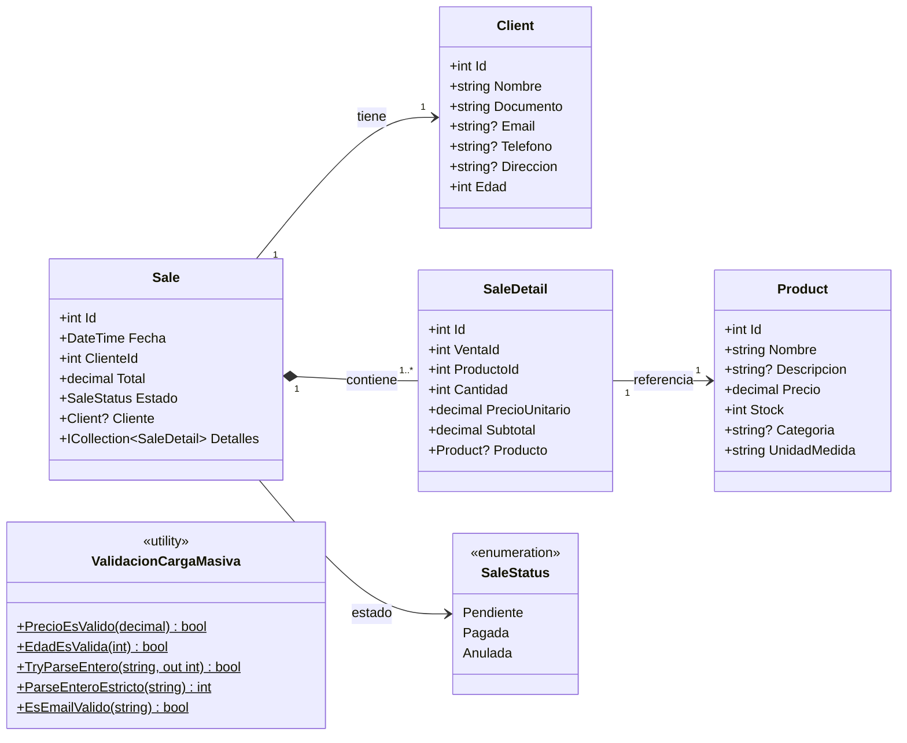

# Diagramas de Firmeza

## Diagrama de clases

> Convención de nombres: los DbSets en `ApplicationDbContext` usan nombres en español (`Productos`, `Clientes`, `Ventas`, `DetalleVentas`), mientras que las clases de entidad usan nombres en inglés (`Product`, `Client`, `Sale`, `SaleDetail`).

## Diagrama entidad-relación

Ver imagen en `docs/EDR.png`.

## Notas de arquitectura

- `SaleDetail.Subtotal` es una propiedad calculada (`Cantidad * PrecioUnitario`), no almacenada en base de datos.
- `Sale.Total` es almacenado y se calcula en el page model al crear/editar la venta (`Detalles.Sum(d => d.Subtotal)`).
- `ValidacionCargaMasiva` es una clase utilitaria estática en `Firmeza.Web/Validation/`. Sus métodos son usados tanto por `Pages/CargaMasiva/Index.cshtml.cs` como por los tests unitarios en `tests/Firmeza.UnitTests/CargaMasivaValidacionTests.cs`.
